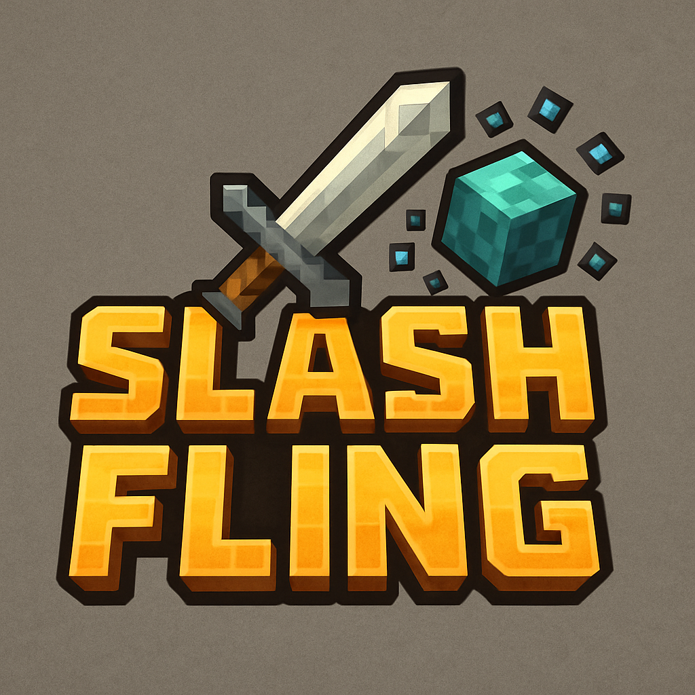

<p align="center">
  
</p>

<h1 align="center">SlashFling</h1>

<p align="center">
  <a href="https://hangar.papermc.io/awiones/SlashFling"></a>
  <a href="https://modrinth.com/project/slashfling"></a>
  <a href="https://github.com/awiones/SlashFling"></a>
  <a href="https://github.com/awiones/SlashFling/blob/main/LICENSE"></a>
</p>

<p align="center">
  A Minecraft plugin that lets you fling players into the air with fall damage resistance!<br>
  <b>Perfect for fun servers, minigames, or just to surprise your friends.</b>
</p>

---

## Installation

- **[Download from Hangar](https://hangar.papermc.io/awiones/SlashFling)**
- **[Download from Modrinth](https://modrinth.com/project/slashfling)**
- Or build from source with Maven:
  ```bash
  mvn clean package
  ```
  The plugin JAR will be in the `target/` directory.

Place the JAR file in your server's `plugins` folder and restart the server.

## Features

- Fling any player into the sky with a single command
- Automatic fall damage resistance for safe landings
- Cooldown system to prevent spam
- Permissions for admin, usage, cooldown bypass, and immunity
- Configurable strength, cooldown, and resistance duration
- Reload configuration without restarting the server

## Usage

- `/fling <player>` — Fling a player into the sky
- `/fling reload` — Reload the plugin configuration (requires admin permission)

### Example

```
/fling Steve
```

## Permissions

| Permission              | Description                                   | Default |
| ----------------------- | --------------------------------------------- | ------- |
| `slashfling.use`        | Allows using the `/fling` command             | op      |
| `slashfling.admin`      | Grants all admin permissions (reload, bypass) | op      |
| `slashfling.immune`     | Prevents being flung by non-admins            | false   |
| `slashfling.nocooldown` | Exempts from command cooldowns                | false   |

## Configuration

Edit `plugins/SlashFling/config.yml` to customize:

- `cooldown-seconds`: Cooldown time between uses
- `fling-strength`: How high to fling players
- `resistance-duration-ticks`: Fall damage resistance duration (20 ticks = 1 second)
- Customizable messages with color codes

After editing, use `/fling reload` to apply changes.

## Contributing

Pull requests and issues are welcome! Please open an issue for bugs or feature requests.

## License

This project is licensed under the MIT License. See [LICENSE](LICENSE) for details.
